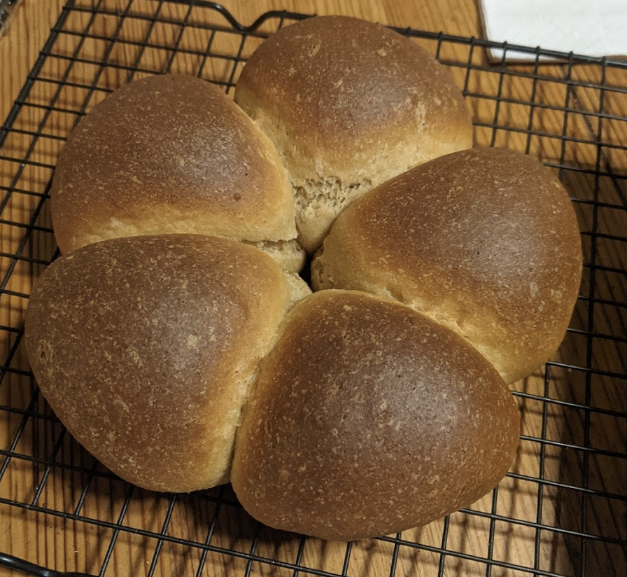

# Whole wheat milk bread

Source: [King Arthur Flour](https://www.kingarthurbaking.com/recipes/100-whole-wheat-pain-de-mie-recipe)

Time: few hours

Notes: This made a 8" round of rolls and a 8" pain de mie. I think I'll try making exactly 60% for the PDM loaf and making sure the loaf is really long and even to get the full PDM effect:
52 apf, 318 wwf, 21 sugar, 270 milk, 4 yeast, 7 salt, 51 oil. and make sure to grease the aluminum foil lid!
Or maybe even 50%?

Story: This is my favorite all-whole-wheat bread, at least on day 1! I'll have to see how long it lasts...

## Ingredients

|Ingredient|Amount|
|---|---:|
|all-purpose flour|87 g|
|wholewheat flour|530 g|
|sugar|35 g|
|milk|450 g|
|yeast|7 g|
|salt|12 g|
|(coconut) oil|85 g|

## Instructions
1. Combine all of the ingredients, and form a smooth, supple dough.

2. Alow the dough to rise until puffy though not necessarily doubled in bulk, about 1 1/2 hours.

3. Lightly grease a 8x4 pain de mie (pullman) pan. Transfer the risen dough to a lightly greased work surface, shape it into a log, and fit it into the pan. Flatten the top as much as possible. Cover the pan with lightly greased plastic wrap, and allow the dough to rise until it's about 1/2" below the lip of the pan, about 45 minutes. > mine rose way more than that... hmmm

4. Preheat your oven 350°. Carefully slip the cover onto the pan, and let it rest an additional 15 minutes while the oven heats.

5. Bake the bread for 25 minutes. Remove the rolls from the oven. PDM: Remove the pan from the oven, carefully remove the lid, and return the bread to the oven to bake for an additional 10 to 15 minutes, until it's golden-brown on top and tests done; an instant-read thermometer inserted into the center will register 190°F.

6. Remove the bread from the oven, and turn it out of the pan onto a rack to cool completely. For a soft, flavorful crust, brush the loaf with melted butter while warm.

7. Store, well-wrapped, on the counter for 5 days, or freeze for up to 3 months.