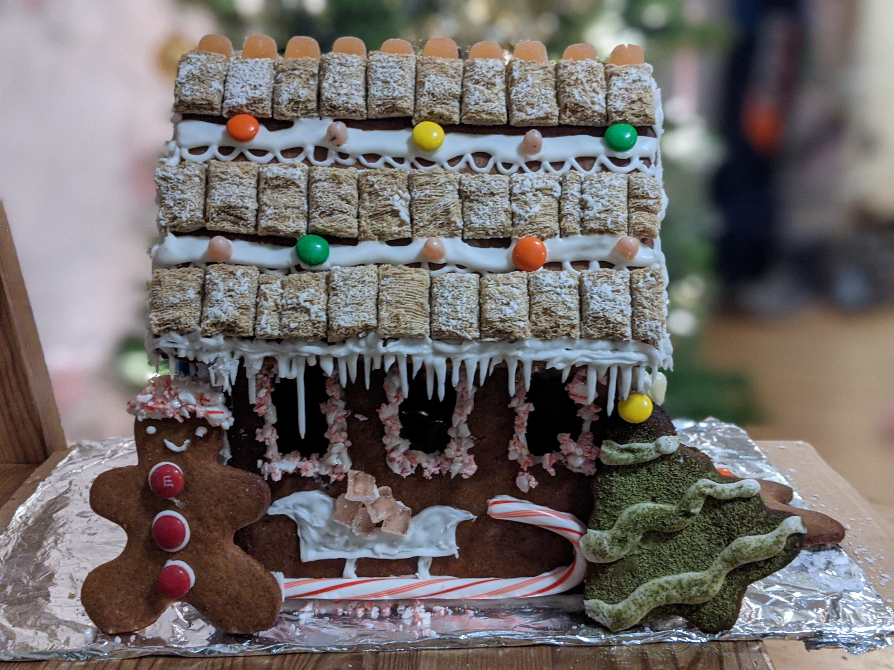

# Gingerbread house

Source: [Stella Parks](https://www.seriouseats.com/recipes/2016/10/construction-gingerbread-recipe.html), [Template](http://www.gingerbread-house-heaven.com/support-files/free-gingerbread-house-pattern.pdf)

Time: tooooo long

Notes: First I only made one batch of the gingerbread dough, and then I realized that I had printed out REALLY BIG template - in general, we followed a philosophy of "go big or go home" since decorating a pre-made gingerbread house is so easy lol. Also, I broke our hand mixer trying to mix the cement-like royal icing. The hardest part of this was probably figuring out the ratios of how much gingerbread, powdered sugar, and egg white we actually needed; the below are estimates of the amount we actually used.

Story: After seeing pretty gingerbread houses on r/baking, I found myself browsing through different templates online when I had trouble falling asleep. I don't have the patience to decorate and work with icing, but I know my sister does, so we took a bit of a [Homemade Gingerbread House Kit](https://www.youtube.com/watch?v=mc4fBTpB6eQ) approach where I made the cookie component and then allowed her the creative freedom to do the "fun part." I had the most fun putting a ceramic pig figurine inside and coming up with metaphors about arresting the police - next time, I would like to put a gingerbread man inside to continue the "trapped in my flesh house" theme. There is also something incredibly satisfying about building a house from scratch, and knowing that each of the six pieces, with all their jagged edges and cracks, were made from raw ingredients. Due to COVID, we haven't been going grocery shopping, so it was much harder to buy small boxes of candy like gumdrops; I'm proud of our ingenuity in repurposing random candies that have been sitting on our counter, like a pack of Altoids, some Japanese gummies, etc.

## Ingredients
### Gingerbread
|Ingredient|Amount|
|---|---:|
|sugar|138 g|
|molasses|30 g|
|cinnamon|2 tbsp|
|ground ginger|4 tsp|
|salt|1/4 tsp|
|corn syrup|345 g|
|very soft butter|140 g|
|all-purpose flour|535 g|

### Royal icing
|Ingredient|Amount|
|---|---:|
|egg whites|3|
|powdered sugar|765 g|

### For decorating
M&M's, candy canes, frosted wheats, random candy that we've collected over the years (altoids, Japanese gummies, jelly beans...)

## Instructions
### Gingerbread
1. Trim a sheet of parchment paper to fit the interior of a half sheet pan. Adjust oven rack to lower-middle position and preheat to 350°F (175°C). Combine everything but the flour and mix on low until smooth, then sprinkle in flour and continue mixing to form a stiff dough. Knead until smooth. Proceed immediately, or wrap in plastic and set aside at room temperature until needed, up to 24 hours. (Larger batches should be divided into 14-ounce portions.)

2. Sprinkle prepared parchment with oil, place dough on top, and flatten into a rectangle. Sprinkle with more oil and roll to fit just within edges of parchment, leaving dough about 3/16 inch thick. Using both hands, transfer parchment to a half sheet pan. Cut according to your gingerbread house template, using an X-Acto or knife. Leave a narrow border of dough around cutouts to minimize spreading, but trim away larger areas of excess dough to gather and re-roll.

3. Bake gingerbread until dry to the touch and golden brown, about 20-25 minutes. Immediately cut along pre-scored lines with a sharp knife or pizza wheel. Cool completely in pan, then transfer cutouts to a safe place. Scraps can be nibbled, or ground in a food processor to use in recipes that call for cookie crumbs.

### Royal icing
1. Combine egg white with half the powdered sugar. Mix at low speed until sugar disappears into a paste, then gradually sprinkle in the rest. Increase speed to medium and beat until smooth and light, about 2 minutes. If too stiff, thin icing with a few drops of water. Use immediately; keep covered tightly in plastic to prevent icing from drying in bowl. Royal icing can be kept in an airtight container at room temperature up to 12 hours.

### Construction
1. Construct the base first, and let it dry for at least 30 minutes.
2. Add lights/figurines inside, then add the roof. 
3. Let sit overnight to dry, and then decorate!