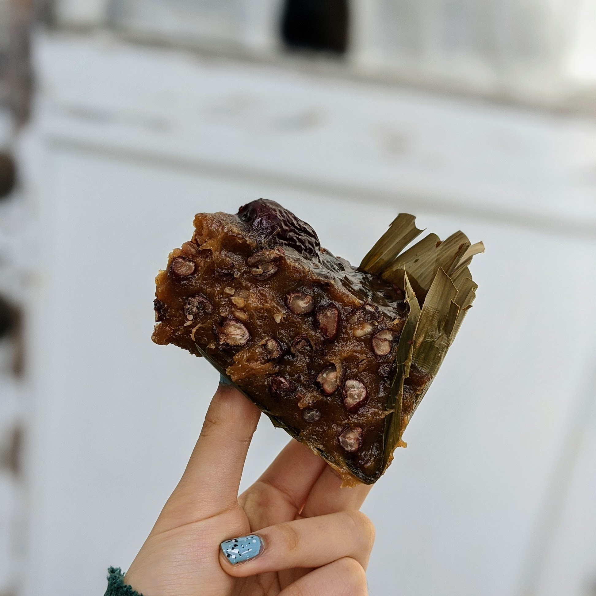

# Red Bean Nian Gao

Source: [https://whattocooktoday.com/nian-gao.html](What to Cook Today)

Time:

Notes: This made too much, would probably do 2/3 next time. and also it was reallyyyy sticky so would try a recipe with rice flour, and less sugar. want to try [this](https://dusdoughs.com/2020/10/23/baked-sweet-nian-gao-mochi-cake/) next time.

Story: I finally got my hands on some sweet rice flour by going to Ranch 99 with Nora! I wanted to make some form of 粘糕 to celebrate the new year, and I've never made a steamed version before (always the butter mochi version). I think I still like that version better, but this was cool to try out.

## Ingredients

|Ingredient|Amount|
|---|---:|
|sweet rice flour|420 g|
|water|420 g|
|sugar|250 g|
|molasses|30 g|
|bamboo leaves|4|
|jujubes (decoration)|4|
|dried red beans|3/4 cup|
## Instructions
1. Soak the red beans for 8 hours and then cook in instant pot for 30 minutes.
2. Blanch the banana leaves in hot boiling water for about 5 minutes to soften it. Then pat dry and set aside
Cut the banana leaves into 7-inch width and about 7-8 inch length. Line the leaf horizontally and then vertically like a "+" (overlapping at the bottom of the dish) and then diagonally like an "X" to make sure I cover all the side and bottom of the dish. Repeat this pattern for 2 more times.  (Lol or just freestyle line it...)
3. Place both sugar and water in a saucepan and bring to a gentle simmer or until sugar is melted. Remove from the heat and let it cool down completely.
4. Gradually pour the sugar mixture into the flour and stir until smooth.
5. Add cooked, drained red beans.
6. Steam in instant pot for 90 minutes
7. Let cool overnight